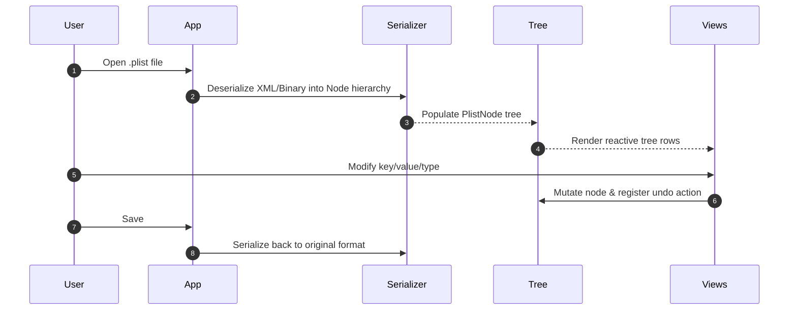

# Key flows

```mermaid
sequenceDiagram
    autonumber
    User->>App: Open .plist file
    App->>Serializer: Deserialize XML/Binary into Node hierarchy
    Serializer-->>Tree: Populate PlistNode tree
    Tree-->>Views: Render reactive tree rows
    User->>Views: Modify key/value/type
    Views->>Tree: Mutate node & register undo action
    User->>App: Save
    App->>Serializer: Serialize back to original format
```
